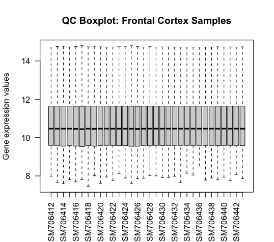
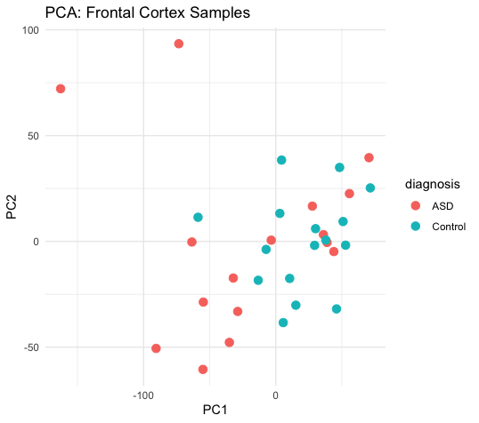

# Autism Transcriptomics (GSE28521) — Frontal Cortex DGE + GO (R / limma)

Beginner-friendly differential gene expression (DGE) project comparing **ASD vs Control** in brain transcriptomic data, using:

- QC: boxplots + PCA
- Differential expression: **limma**
- Probe → Gene mapping: **official GEO platform annotation (GPL6883)**
- Functional interpretation: GO Biological Process enrichment (**clusterProfiler**)

This repo is designed as a portfolio project to demonstrate foundational transcriptomics + reproducible analysis practices.

---

## Project structure

- `code/` : analysis scripts (run in order)
- `results/figures/` : exported plots
- `results/tables/` : exported result tables
- `data_raw/` and `data_processed/` are kept local and ignored in GitHub via `.gitignore`

---

## Scripts (run in order)

1. `01_download_data.R`  
   Downloads / loads GSE28521 and prepares expression matrix inputs.

2. `02_prepare_metadata.R`  
   Builds the phenotype/metadata table (ASD vs Control labels, sample info).

3. `03_QC_EDA.R`  
   QC + exploratory analysis (boxplots, PCA) and saves plots to `results/figures/`.

4. `04_DE_Limma.R`  
   Runs limma differential expression and saves DE table(s) to `results/tables/`.

5. `05_GO_Analysis.R`  
   Maps probes to gene IDs using **GPL6883** annotation from GEO and performs GO enrichment for up/down gene sets.

---

## Key outputs

### QC Boxplot

### PCA (Frontal cortex)

### Volcano Plot
- PDF: `results/figures/Volcano_ASD_vs_Control_Frontal.pdf`

### GO Enrichment (Biological Process)
- Upregulated: `results/figures/GO_BP_ASD_Up.pdf`
- Downregulated: `results/figures/GO_BP_ASD_Down.pdf`

### Differential Expression Table
- `results/tables/DEG_ASD_vs_Control_Frontal.csv`

---

## Notes / limitations

- Bulk brain tissue mixes cell types; DE signals may reflect cell-type composition differences.
- GO enrichment results should be interpreted conservatively, especially when the number of significant DE genes is small.
- This project focuses on establishing correct end-to-end DGE workflow; future extensions include ranked GSEA, cross-region replication, and cell-type marker checks.

---

## How to run

Open the RStudio project (`autism-transcriptomics-analysis.Rproj`), then run scripts in the `code/` folder in order (01 → 05).

